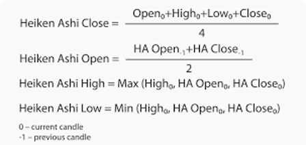

## Overview of Bitcoin market
- Cryptos in general are a volatile asset. Bitcoin market was in a bear run from 2018 to 2019 and then went for a bull run for the next 6 months.
- From then till march of 2020 i.e, just before covid, market was extremely volatile.
- This skewness preference amplifies mispricing, and we expect to make very good short-term profits.

***The Bitcoin has a massive CAGR of 36% in our testing period and sharpe ratio of 1.3.***

## Major Parameters Explored
1. Heiken Ashi Charts  
Heiken Ashi candles are a special type of candlestick chart that helps filter out market noise, providing a smoother representation of price trends. These candles consider open, close, high, and low prices to offer a more balanced view of the market direction.

