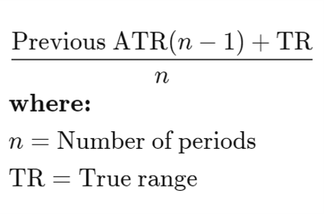

## Overview of Bitcoin market
- Cryptos in general are a volatile asset. Bitcoin market was in a bear run from 2018 to 2019 and then went for a bull run for the next 6 months.
- From then till march of 2020 i.e, just before covid, market was extremely volatile.
- This skewness preference amplifies mispricing, and we expect to make very good short-term profits.

***The Bitcoin has a massive CAGR of 36% in our testing period and sharpe ratio of 1.3.***

## Major Parameters Explored
1. Heiken Ashi Charts  
Heiken Ashi candles are a special type of candlestick chart that helps filter out market noise, providing a smoother representation of price trends.

2. Average Directional Index (ADX)  
ADX, or Average Directional Index, is a technical indicator designed to measure the strength of a trend in a financial market. It quantifies the strength of a trend on a scale from 0 to 100, with higher values indicating a stronger trend. 
3. Exponential Moving Average (EMA)  
An exponential moving average (EMA) is a type of moving average (MA) that places a greater weight and significance on the most recent data points. 
4. Average True Range (ATR)  
The true range indicator is taken as the greatest of the following: current high less the current low; the absolute value of the current high less the previous close; and the absolute value of the current low less the previous close.

## Final Presented Strategies
1. Heiken Ashi + ADX  
We eventually chose Heiken Ashi candles and the ADX indicator for swing trading. By using Heiken Ashi candles, we aimed to reduce noise and create a clearer representation of the underlying trend. The ADX indicator was employed to identify the strength of a trend.

3. Heiken Ashi + EMA Short-shell  
In our trading strategy, we used two different approaches for buying and selling. For going long, we used Heiken Ashi candles to reduce noise. A trailing stop loss was implemented based on the Average True Range (ATR) to manage risk and protect positions. We incorporate the Exponential Moving Average (EMA) with a length 5 for executing short trades. Our strategy hinges on identifying instances of market overextension

5. Heiken Ashi + 2 ADX  
The aim was to strike a better balance between identifying meaningful trends and minimizing the impact of noise in the market. We need to filter out the noise present in smaller time frames and thus Heiken Ashi candles and the ADX indicator seems to be driven by the Swing trading on higher time frames

